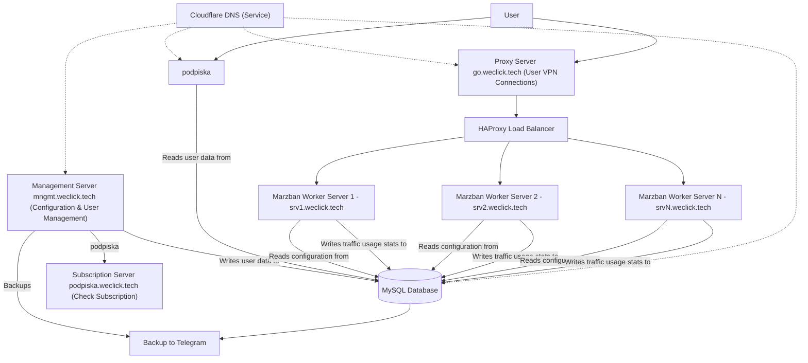

# Service description

## Service scheme

### Diagram Explanation:

1. **Cloudflare DNS**: Used solely for DNS resolution, directing traffic to the appropriate servers (no direct user entry point).
2. **Proxy Server (go.weclick.tech)**: The entry point for user VPN connections. It distributes traffic to the **Marzban Worker Servers** via **HAProxy**.
3. **Management Server (mngmt.weclick.tech)**: Manages user configurations, writes user data to **MySQL**, and performs backups to Telegram.
4. **MySQL Database**: Centralized storage for user data and configurations, hosted on the **Management Server**.
5. **Subscription Server (podpiska.weclick.tech)**: Users check their subscription status here, and it reads user data from **MySQL**.
6. **Marzban Worker Servers**: These servers handle VPN connections. They:
   - Read their configurations from **MySQL**.
   - Write traffic usage statistics back to **MySQL** for reporting.
7. **HAProxy**: Distributes traffic from **go.weclick.tech** (the entry point) to the **Marzban Worker Servers**.

This updated diagram should now accurately represent your infrastructure, with clear distinctions about data flow and user interaction points.

## Servers

| Server Name        | IP Address       | Role                 | Hosting Provider | Expiration Date |
|--------------------|------------------|-----------------------|------------------|-----------------|
| mngmt.weclick.tech | 103.102.231.111     | Management Server/podpiska    | IP Hoster      | 2025-02-06      |
| go.weclick.tech    | 178.23.190.177     | Proxy Server         | pq.hosting             | 2025-02-12      |
| srv1.weclick.tech | 94.131.9.187   | Marzban Worker Server | pq.hosting           | 2025-03-09      |
| srv2.weclick.tech  | 5.144.181.118      | Outline Server | IP Hoster      | 2025-03-23     |
| srv3.weclick.tech  | 95.164.17.213     | Marzban Worker Server | pq.hosting          | 2025-02-28      |
| srv4.weclick.tech  | 95.164.86.222     | Marzban Worker Server | pq.hosting         | 2024-12-12     |
| srv5.weclick.tech  | 45.89.110.58     | Marzban Worker Server | pq.hosting           | 2025-02-12      |
