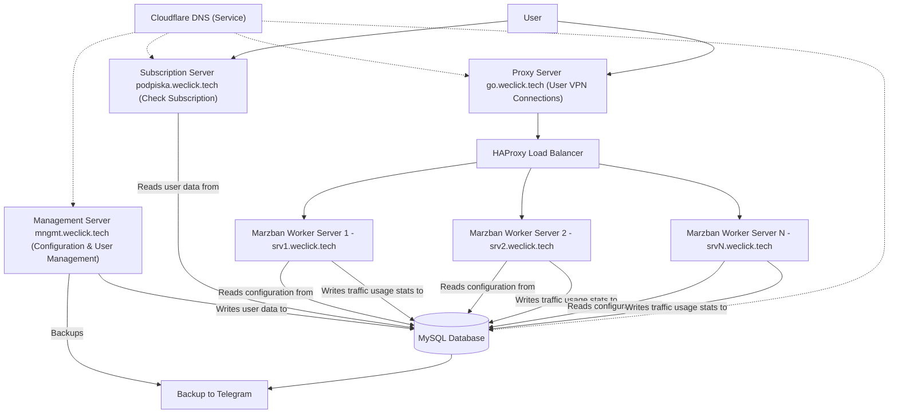

### Diagram Explanation:

1. **Cloudflare DNS**: Used solely for DNS resolution, directing traffic to the appropriate servers (no direct user entry point).
2. **Proxy Server (go.weclick.tech)**: The entry point for user VPN connections. It distributes traffic to the **Marzban Worker Servers** via **HAProxy**.
3. **Management Server (mngmt.weclick.tech)**: Manages user configurations, writes user data to **MySQL**, and performs backups to Telegram.
4. **MySQL Database**: Centralized storage for user data and configurations, hosted on the **Management Server**.
5. **Subscription Server (podpiska.weclick.tech)**: Users check their subscription status here, and it reads user data from **MySQL**.
6. **Marzban Worker Servers**: These servers handle VPN connections. They:
   - Read their configurations from **MySQL**.
   - Write traffic usage statistics back to **MySQL** for reporting.
7. **HAProxy**: Distributes traffic from **go.weclick.tech** (the entry point) to the **Marzban Worker Servers**.

This updated diagram should now accurately represent your infrastructure, with clear distinctions about data flow and user interaction points.

